# Soul-Harmony
The Soul Harmony website is a landing page for all people of any age who are trying to find inner peace and tranquility, take their mind off all their problems and relax.

Soul Harmony brings value to users by offering a wide range of meditation practices, guides, and resources to help them start and develop their meditation journey. The website also provides the opportunity to join a supportive community where members can share their experiences, ask questions and receive support.
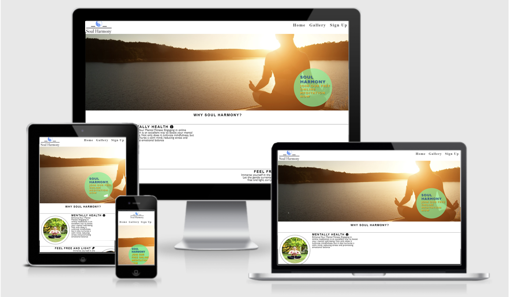
## Features
- Navigation
    - The top navigation displays the name of the meditation site: Soul Harmony, which is linked at the top of the page. And also the name itself (the logo located at the top) is considered clickable, and when you click on the logo, you will be loaded onto the main page.
    - All other navigation links are on the right, such as: "Home", "Gallery", "Sign Up", which lead to different pages, depending on what you want.
    - Navigation is made in a font and color suitable for the background.
    - Navigation clearly informs the user of the name of the website, and makes it easier to find the sections the user needs.

- Logo
    - The logo is a simple image, which is located at the top of the page.
    - The logo is clickable, and when you click on the logo, you will be loaded onto the main page.
    

- Header/Why Soul Harmony
    - The header displays the name of the site, asking the user why us?
    - Below is an image and answers to the question why Soul Harmony. What a user can come to us for.
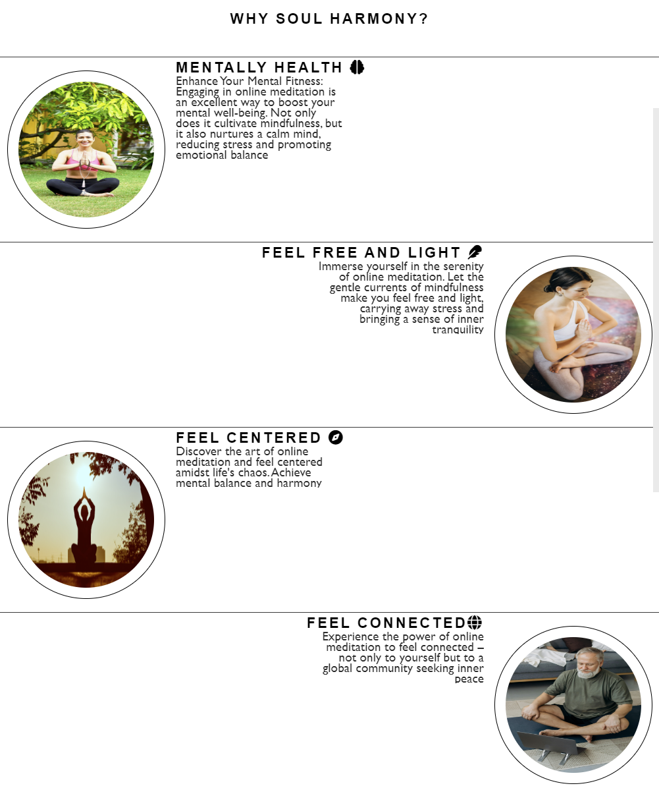
- Footer
    - The footer is made in a font and color suitable for the background.
    - The footer contains the social media links.
      
       

- VideoPlayer
    - The video player is a video that is played in the background.
    - A video plays automatically, which is pleasant to watch and also relaxing.
    - The video is also responsive, and it is displayed in a way that it is suitable for all devices.
    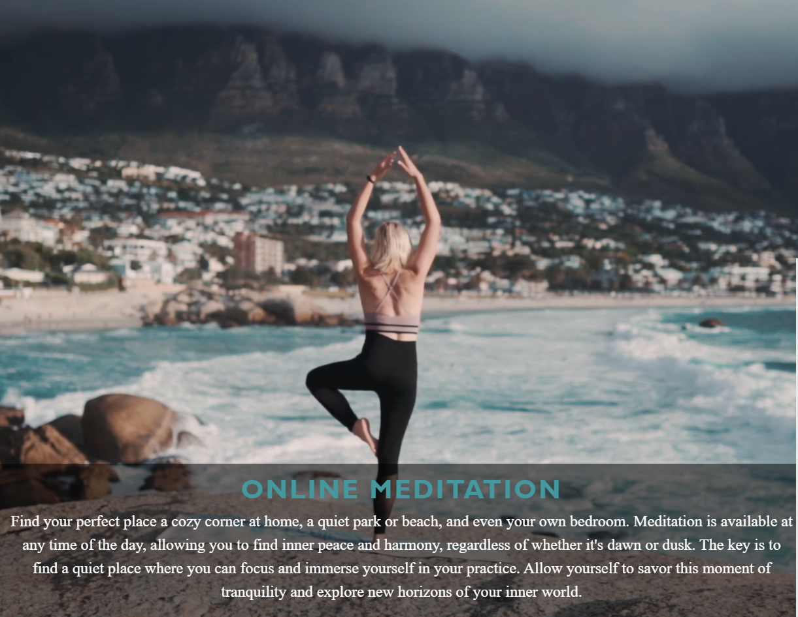

- Gallery
    - The gallery is a page that displays the images of the meditation practices.
    - The images are displayed in a way that it is suitable for all devices.
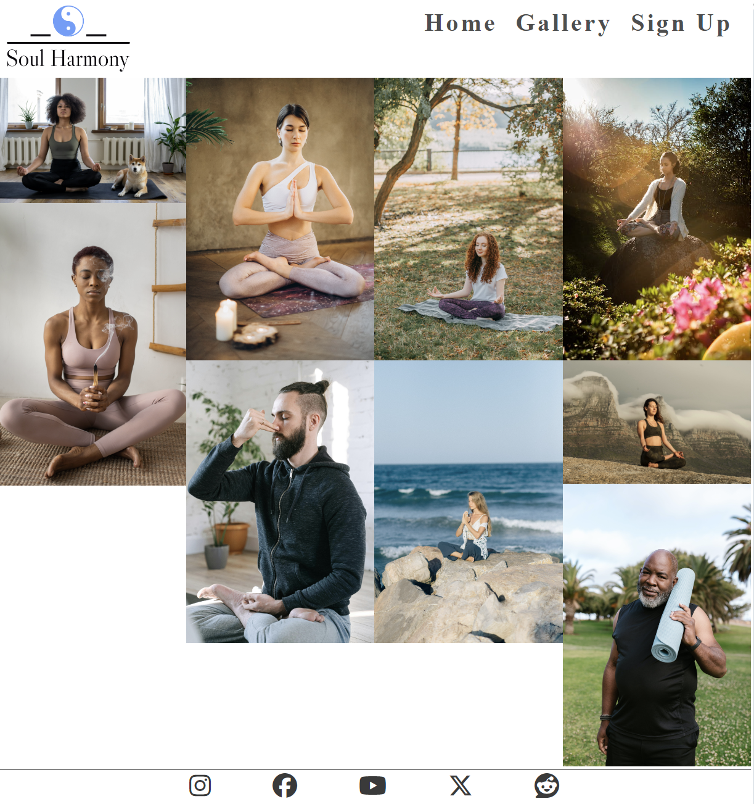

- Sign Up
    - The sign up page is a page that asks the user to fill in their details.
    - The details are used to create a user account.
    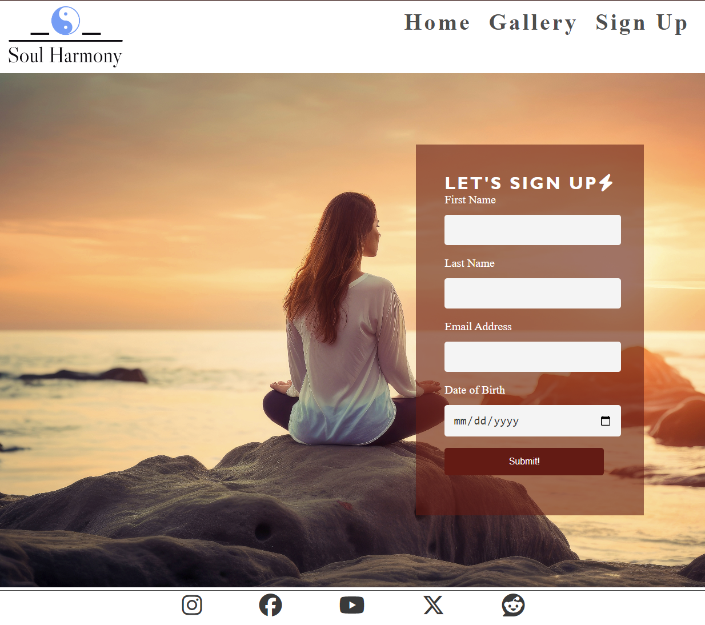
    - The sign up notification upon registration with automatic transition to the main page after 10 seconds
    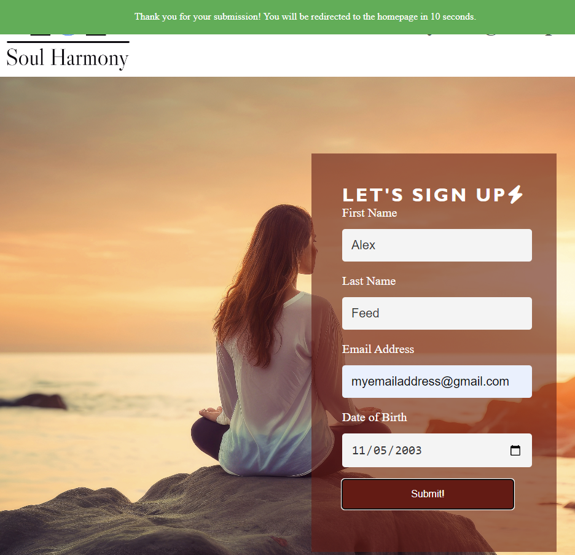

## Testing
- I tested this page works in different browsers: Chrome, Opera, Internet Explorer.
- I tested the page works on different devices: Laptop, Desktop, Tablet.
- I have confirmed that the navigation, header, gallery, sign up, footer, video player work as intended, and easy to understand.
## Bugs
Solved bugs
- The navigation is not responsive, and it is not displayed in a way that it is suitable for all devices.
- The videoPlayer is not responsive, and it is not displayed in a way that it is suitable for all devices(shows black screen).
- Gallery photos are not responsive, and they are not displayed in a way that it is suitable for all devices.
## Validator Testing
- HTML
    - No errors were returned when passing through the official [W3C validator](https://validator.w3.org/#validate_by_input)
    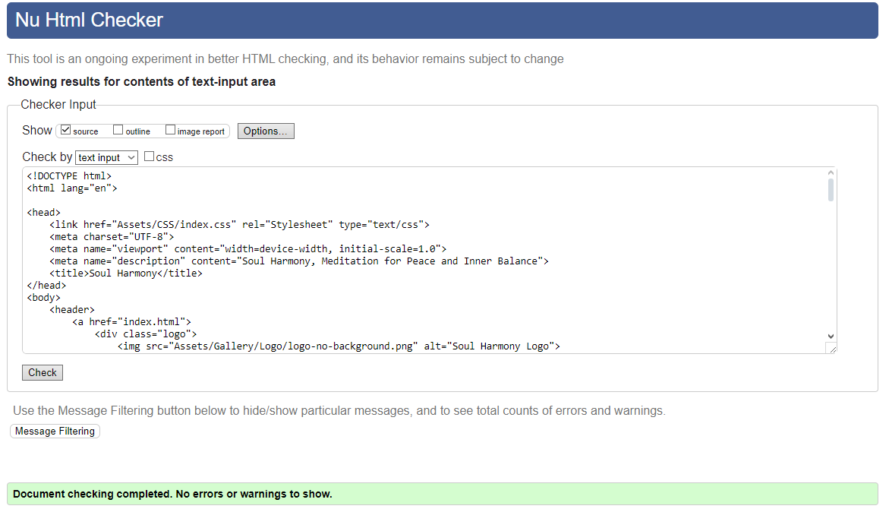
- CSS
    - No errors were found when passing through the official [Jigsaw validator](https://jigsaw.w3.org/css-validator/)
    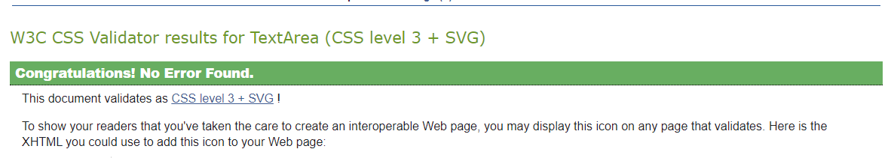
- Accessibility
    - I confirmed that the selected colors and fonts are easy to read and accessible by running them through Lighthouse.
    
  1. Home page 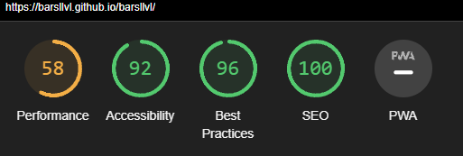
  2. Gallery page 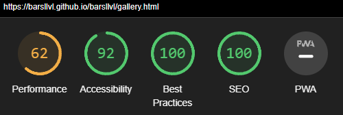
  3. Sign-up page 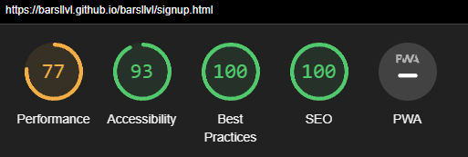

# Unfixed Bugs
- No bugs were found.
# Fixed Bugs
- The navigation is not responsive, and it is not displayed in a way that it is suitable for all devices.
- The videoPlayer is not responsive, and it is not displayed in a way that it is suitable for all devices(shows black screen).
- Gallery photos are not responsive, and they are not displayed in a way that it is suitable for all devices.

## Deployment
- The site was deployed to GitHub pages. The steps to deploy are as follows:
    - In the GitHub repository, navigate to the Settings tab
    - From the source section drop-down menu, select the Master Branch
    - Once the master branch has been selected, the page provided the link to the completed website.

The live link can be found here - [Soul Harmony](https://barsllvl.github.io/barsllvl/).

## Credits
### Content
- Code for adjusting and customizing images for index/gallery.html, was taken from [w3schools](https://www.w3schools.com).
- The code for setting up videoPlayer was taken in part from [YouTube Player API](https://developers.google.com/youtube/iframe_api_reference) and [w3schools](https://www.w3schools.com).
- To create my logo I used [myfreelogomaker](https://myfreelogomaker.com).
### Media
- Images and videos for the website were taken from [Pexels](https://www.pexels.com)
