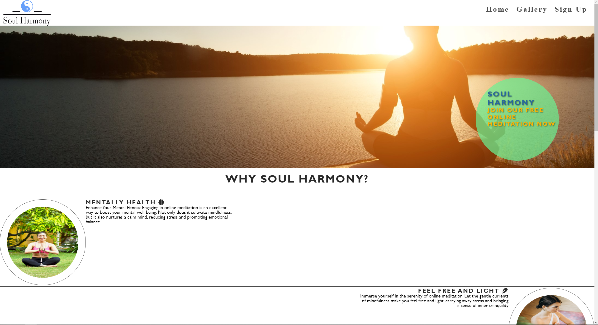
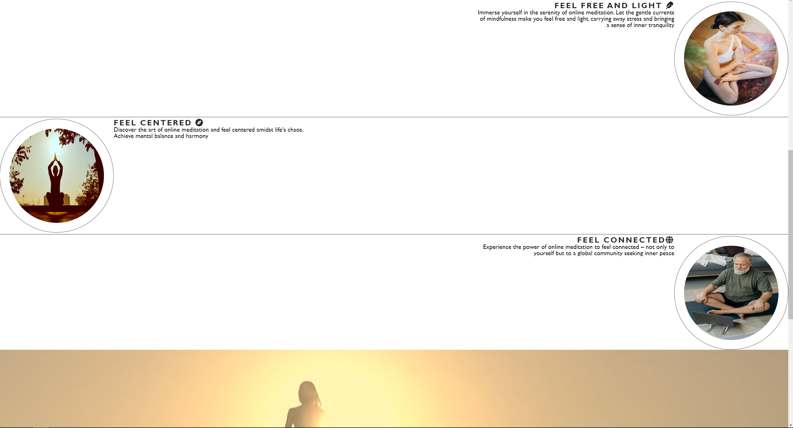
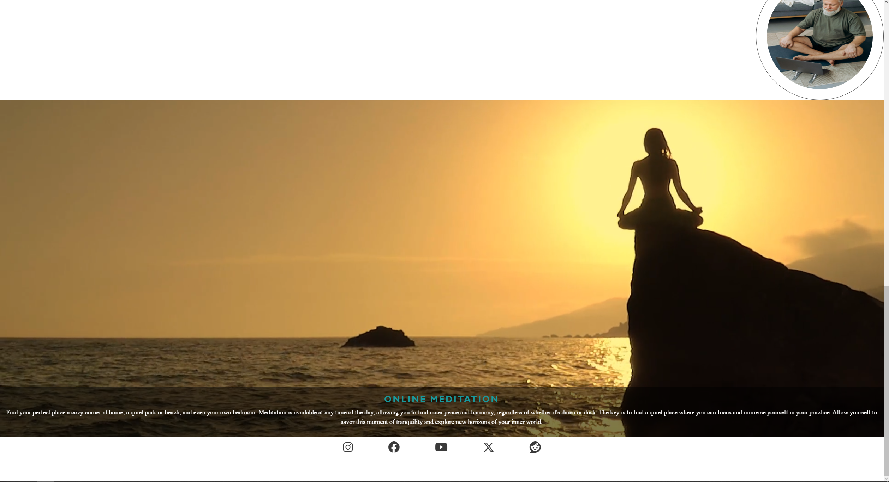

# About Soul-Harmony

## Purpose
Soul Harmony is a website designed to provide users with access to meditation resources and help them achieve inner peace and harmony. The purpose of this website is to offer a platform where people can learn and practice meditation techniques and connect with others.

## Value
Soul Harmony brings value to users by offering a wide range of meditation practices, guides, and resources to help them start and develop their meditation journey. The website also provides the opportunity to join a supportive community where members can share their experiences, ask questions and receive support.

## Deployment Procedure
To deploy the Soul Harmony website, follow these steps:

1. Choose a reliable hosting provider for your website.
2. Register a domain name that reflects the essence of your site.
3. Create and customize your website code using HTML, CSS, JavaScript, PHP and other programming languages if necessary.
4. Make sure that all functions of your website are working correctly and there are no errors.
5. Upload your website to your chosen hosting provider.
6. Set up your domain name to point to your hosting provider.
7. Spread the word about your site through social media, search engine optimization, and advertising.

---

## Attribute
I can’t give the exact resources where I got some parts of the code from or read about them and found out how it works, because I found all the information in various open resources, the main resource is [w3schools](https://www.w3schools.com/html/default.asp), unfortunately I cannot find other resources, there were very, very many of them.
For example, the blog [w3schools](https://www.w3schools.com/php/php_forms.asp) also helped me a lot in creating “submit_form.php”, but there were other sources besides it that I can’t find.

Also, to create the "Video Autoplayer" using PHP language which is located on the "Home" page at the very bottom, I used information from various open resources, such as [Mdn API](https://developer.mozilla.org/en-US/docs/Learn/JavaScript/Client-side_web_APIs/Video_and_audio_APIs) and [YouTube Player API](https://developers.google.com/youtube/iframe_api_reference).

---

## Screenshots of the finished project
### Home Page

---
### Gallery Page

---
### Sign up
